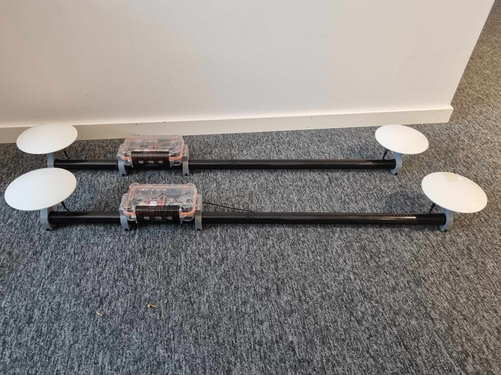
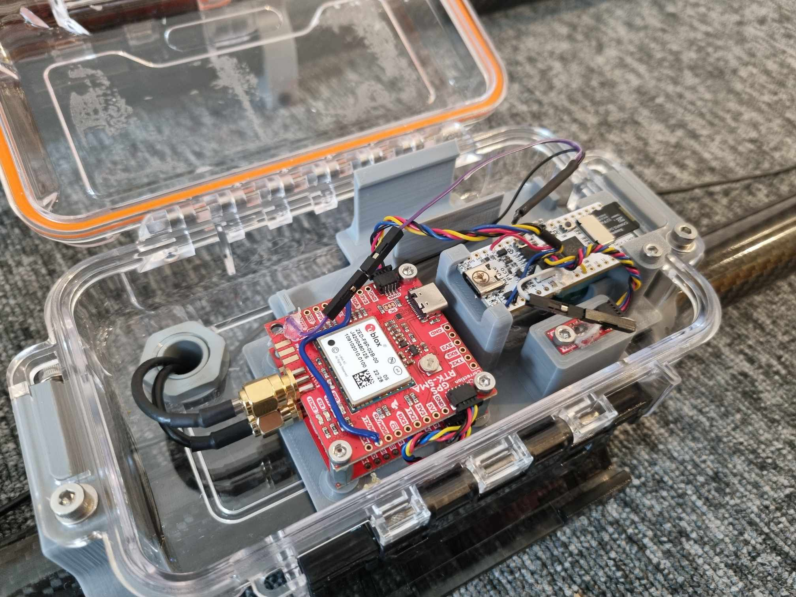
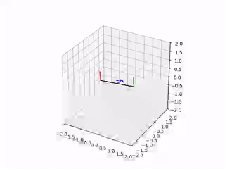
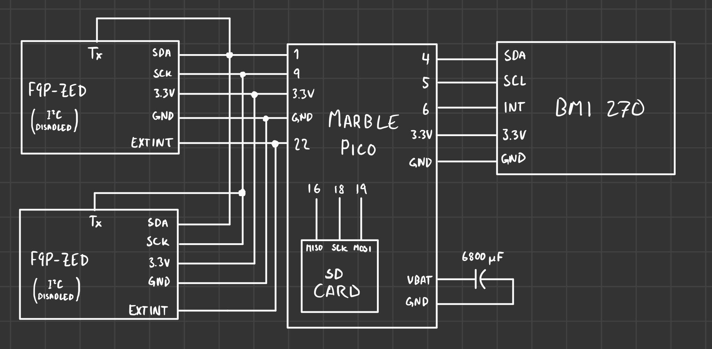
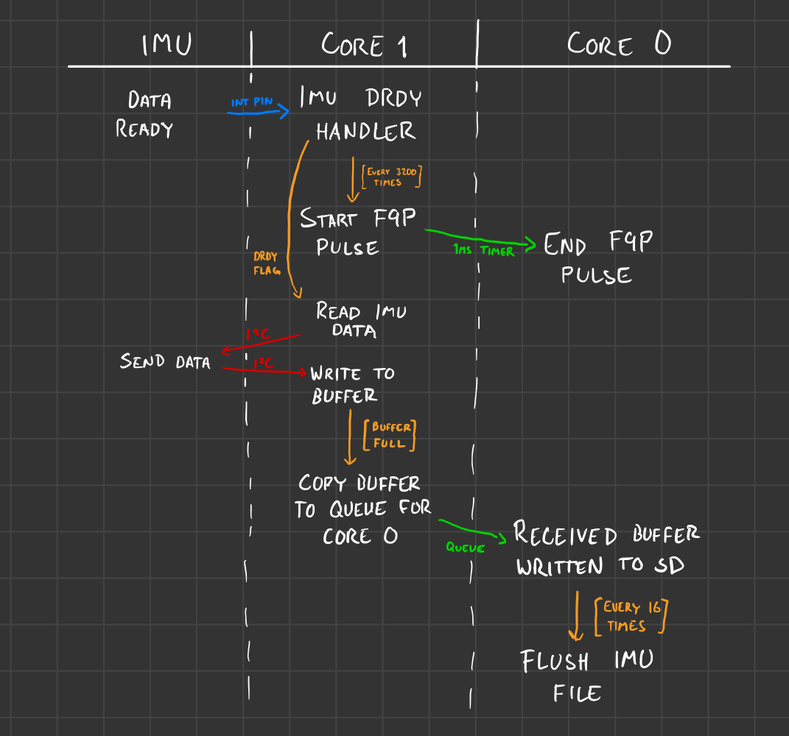
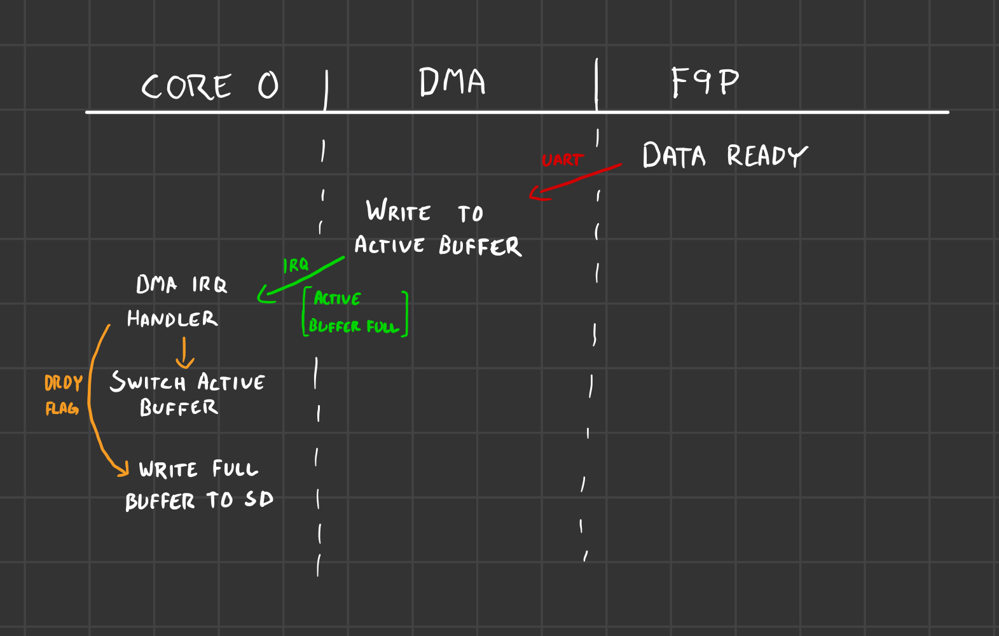

 # My work at NTNU, summer '24
 ## Tracker box
Each tracker box contains a Marble Pico (RP2040 based development board), a BMI270 IMU and two F9P-ZED RTK compatible GNSS receivers with antennas. Everything is powered by a simple USB power bank. 





The boxes' purpose is to log accurately timed position and orientation data of maritime vessels.

 ### Usage
 1. Make sure the SD card is properly formatted, has enough free storage, and is inserted in the Pico. The card does not need to be emptied, and old files are not overwritten.
 2. Make sure that the three jumper cables and all I2C bus connectors are connected.
 3. Connect USB power to the Pico. After four seconds, the built-in LED on the pico should start blinking with two short blinks per second. If anything else happens, see [Troubleshooting](#Troubleshooting).
 4. Close the box and go track something.
 5. When you're done, simply unplug power. The onboard capacitor gives the Pico time to flush and close all files.
 6. The SD card now contains these files:
    - `IMU-[n].bin`
      - Contains raw IMU data in binary.
    - `F9P0-[n].bin` and `F9P1-[n].bin`
      - Contains raw F9P messages in binary.
    - `.count`
      - Contains the number `n` used in the file names of the newest data files. This is automatically incremented or created.
    

 #### Troubleshooting
When everything is working normally, the built-in LED on the Pico should blink with two short blinks each second.

If there is only one short blink each second, then core 1 of the Pico has become unresponsive. This has not occurred with the latest firmware version. Try resetting, power cycling, or re-flashing.

If the LED blinks quickly with 50% duty cycle, there has been a fatal error. Currently, this can be caused by:

 - Fatal error during SD card file system initialization
 - Unsuccessful IMU initialization
 - Fatal internal IMU error after initialization

Make sure that the SD card is properly inserted and that the I2C bus of the IMU is properly connected to the Pico, then reset or power cycle the Pico.

If the LED blinks quickly with ~16% duty cycle, the Pico has detected a brown-out and has flushed and closed all SD card writers to avoid corrupting the file system. A false detection has not yet occured. Resetting the Pico should restart the logging.

 ### Parsing

 #### Data format
The F9P data streams are copied directly to the data files.

The IMU data is stored as a stream of raw, little-endian structs. The struct is defined as
```
typedef struct
{
    bmi_data_t data;
    uint32_t sample_idx;
    uint8_t stamped;
    uint32_t _dummy0[3]; // To make the struct 32 bytes long
} IMU_sample_t;
```
where `bmi_data_t` is defined as
```
typedef struct
{
    int16_t ax;
    int16_t ay;
    int16_t az;
    int16_t gx;
    int16_t gy;
    int16_t gz;
} bmi_data_t;
```
This means that the data is structured as follows:

| byte # | field | type |
| ----- | ------ | ---- |
| 0-1 | acc_x | int16 |
| 2-3 | acc_y | int16 |
| 4-5 | acc_z | int16 |
| 6-7 | acc_x | int16 |
| 8-9 | acc_y | int16 |
| 10-11 | acc_z | int16 |
| 12-15 | sample index | uint32 |
| 16 | acc_z | bool (uint8) |
| 17-31 | dummy | n.a. |

In python, this can be decoded with
```
struct.unpack("<" + "h"*6 + "I" + "B"*4 + "I"*3, raw_bytes)
```
which is applied in the next subsection.

 #### Parsing framework
The `parsing` directory contains a framework for parsing raw tracking data, synchronizing IMU data and F9P timestamps, plus some simple visualization tools. You can for instance replay the IMU data like seen below.



 ### Schematic


 ### Firmware
The firmware uses both cores, `I2C0`, `UART0`, `UART1`, one alarm pool, four DMA channels and `DMA_IRQ_1`. The [SD card library](https://github.com/carlk3/no-OS-FatFS-SD-SDIO-SPI-RPi-Pico) uses two more DMA channels, `SPI0` and `DMA_IRQ_0`.

Core 0 handles initialization of the F9P interface, SD file system, and voltage monitoring. It is responsible for LED control, all SD operations, and voltage monitoring.

Core 1 handles initialization of the IMU and IMU interface, and is responsible for reading IMU data.

For accurate timestamping, the IMU data ready (DRDY) pulse is periodically forwarded to the F9Ps' EXTINT. This should happen around once every 2s. To be able to align IMU data and F9P timestamps that are offset by more than 2s, the interval between each pulse-forward is decreased by one IMU DRDY pulse for each pulse-forward. Every 64 pulse-forwards the interval is reset.

When a pulse is forwarded, the corresponding IMU sample's `stamped` field is set to 1. For all other samples it is set to 0.

The following two diagrams provide an overview of interactions with the IMU and F9Ps, respectively.




 ## CAD work
I have also done some work in CAD to design the mounts and brackets for the tracking boxes, as well as some mounts for a different sensor rig. The `.f3z` archive files for all of these are also in this repository.
